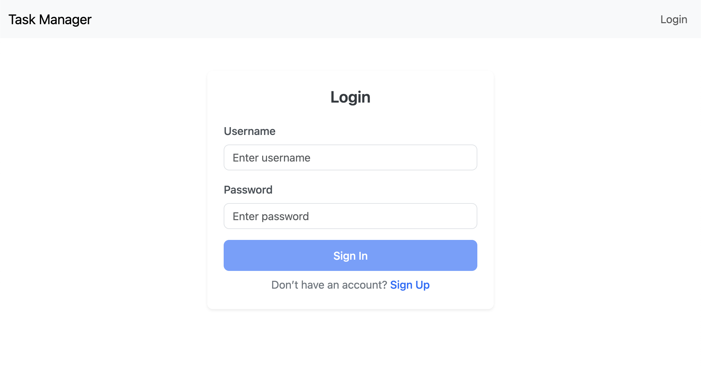
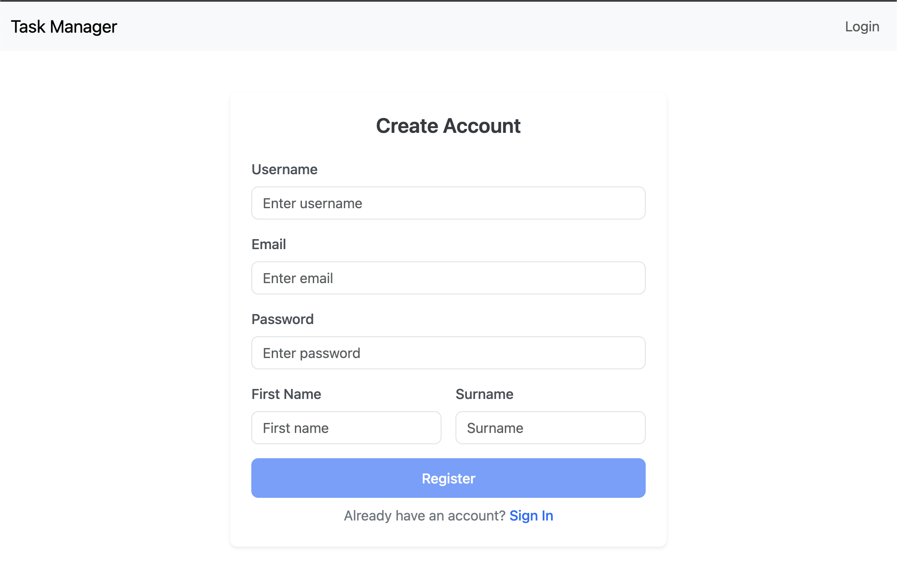
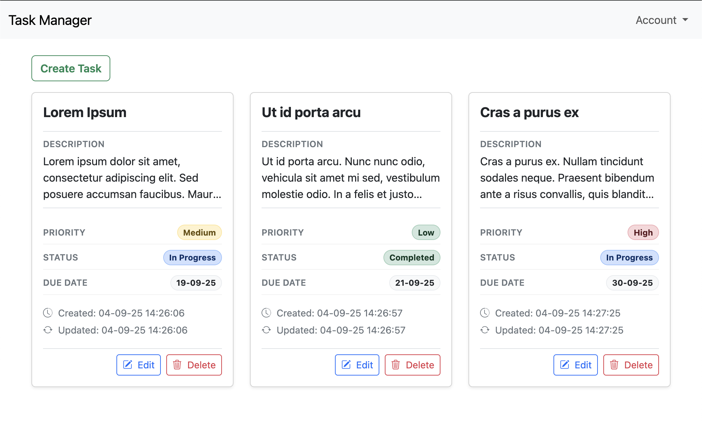
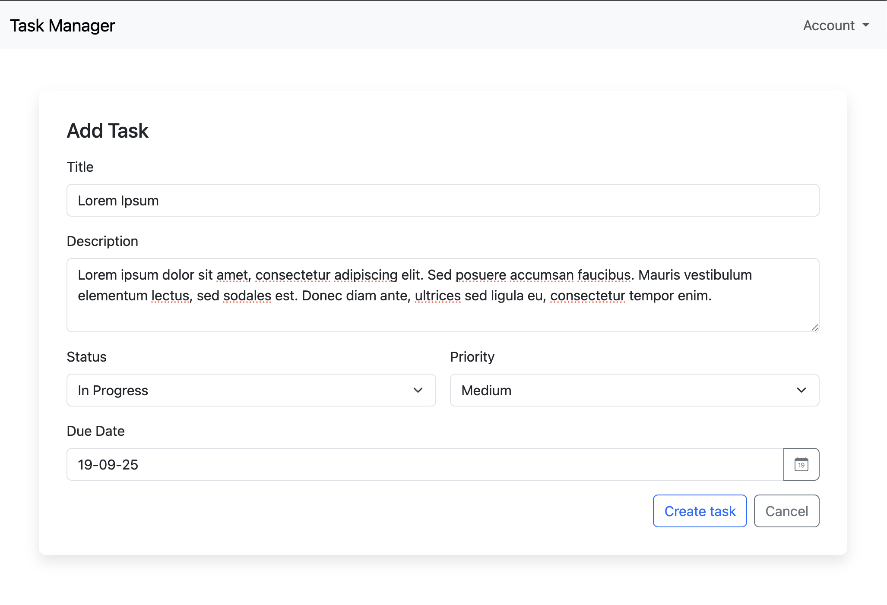
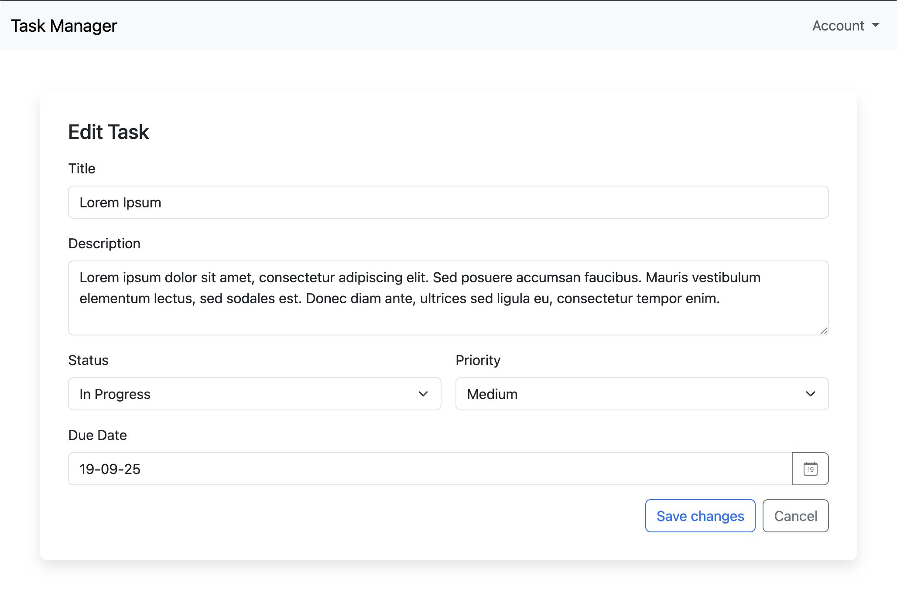
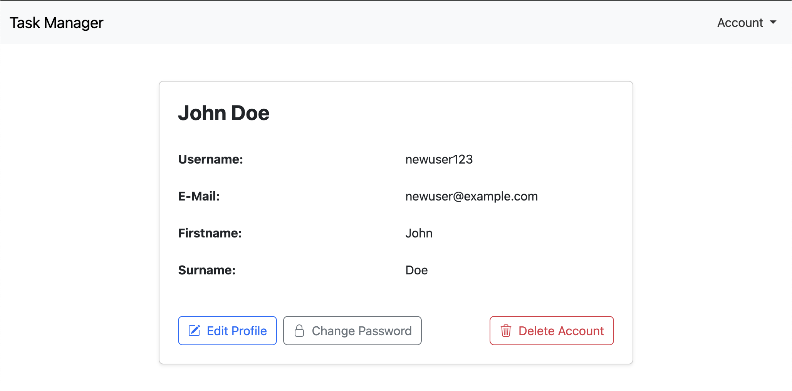
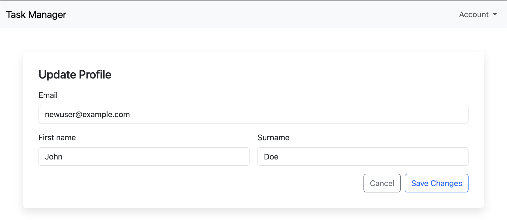
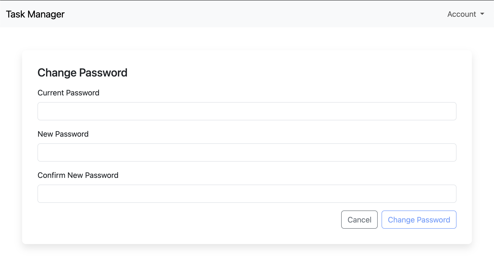

# Task Manager Frontend 

This is the Angular 18 frontend for the Task Manager application.  
It communicates with the Spring Boot backend via REST API and provides a modern UI for user and task management.

You can find the backend repository [here](https://github.com/szenullahu/task-manager-backend).

---

## ⚙️ Tech Stack

- 🅰️ **Angular 18**
- 🎨 **Bootstrap 5.3** + **Bootstrap Icons**
- 💠 **ng-bootstrap** – Angular-native Bootstrap components
- 🔄 **RxJS 7**
- 📡 **Angular HTTPClient** with JWT Interceptor
- 📁 **Angular Router**

---

## 🚀 Getting Started

### ✅ Requirements

Make sure the following tools are installed:

- 🔸 [Node.js (18+)](https://nodejs.org/)
- 🔸 [Angular CLI](https://angular.io/cli)

---

### ▶️ Run the application

Make sure that the Task Manager Backend is running [here](https://github.com/szenullahu/task-manager-backend). 

```bash
npm install
ng serve
```

### 📄 src/environments/environment.ts

```ts
export const environment = {
  production: false,
  apiUrl: 'http://localhost:8080/api'
};
```

---

## 🌐 Authentication and Backend Integration 

The frontend connects to the Spring Boot backend using JWT-based authentication.

- `AuthService` handles login, registration, token storage, and user authentication
- `tokenInterceptor` automatically adds the JWT to all outgoing HTTP requests

### 🔧 Example: Token Interceptor

```ts
export const tokenInterceptor: HttpInterceptorFn = (req, next) => {
  const authService = inject(AuthService);
  const token = authService.getToken();

  if (token) {
    const authReq = req.clone({
      setHeaders: {
        Authorization: `Bearer ${token}`
      }
    });
    return next(authReq);
  }

  return next(req);
};

```

### Example AuthService 

```ts

@Injectable({ providedIn: 'root' })
export class AuthService {
  login(data: { username: string; password: string }): Observable<{ token: string }> {
    return this.http.post<{ token: string }>(`${this.apiUrl}/login`, data);
  }

  register(user: UserEntity) {
    return this.http.post(`${this.apiUrl}/register`, user);
  }

  saveToken(token: string): void {
    localStorage.setItem('token', token);
  }

  getToken(): string | null {
    return localStorage.getItem('token');
  }

  logout(): void {
    localStorage.removeItem('token');
  }

  isAuthenticated(): boolean {
    const token = localStorage.getItem('token');
    if (!token) return false;

    try {
      const payload = JSON.parse(atob(token.split('.')[1]));
      const now = Math.floor(Date.now() / 1000);
      return payload.exp > now;
    } catch (err) {
      return false;
    }
  }
}
```

---

## ✅ Features 


- 📝 Register and log in
- 🔐 Secure JWT authentication
- 📋 View a list of tasks
- ➕ Add new tasks
- ✏️ Edit tasks (title, description, status, etc.)
- 🗑️ Delete tasks
- 👤 View and update user profile
- 🔑 Change password
- 🚪 Logout


---

## 🖼️ Screenshots 

### 🔐 Login Page


### 📝 Register Page


### 📋 Task List Page


### ➕ Create Task Page


### ✏️ Edit Task Page


### 👤 User Page


### 🛠️ Update User Info


### 🔑 Update Password Page



